# Homelab Security Ops: From Hybrid Identity to Offensive Simulation


This repository documents the end-to-end evolution of a corporate infrastructure lab. The project simulates the full lifecycle of an IT environment: from provisioning an on-premise Active Directory and automating tasks with PowerShell, to migrating to a Hybrid Cloud (Entra ID/Intune) and conducting Offensive Security simulations (Red Teaming) to test resilience (Reconnaissance → Exploitation → Credential Access → Forensics).

Repository Content:

/scripts - My PowerShell automation scripts.

/evidence - Screenshots and sample reports proving it works.

Proof of Concept:

## Phase 1: On-Premise Foundation & Automation

**Objective:** Establishing the core infrastructure, managing identity, and automating maintenance tasks.

### 1.1 Infrastructure & Identity
* **DC Setup:** Provisioned Windows Server 2019 as the primary Domain Controller for `martti.local`.
* **Client Integration:** Joined Windows 10 clients to the domain.
* **IAM:** Created organizational structure (OUs) and provisioned user "Jadzia".
 
 
### 1.1.1. Active Directory Setup Domain Controller and connected Client.

**Fig. 1. Active Directory Forest Provisioning**
*Initializing the new AD environment. Configured the server as the first Domain Controller in a new Forest with the root domain `martti.local`.*


**Fig. 2. Login Screen**  
*Server promoted to DC status, verified by the domain login context (`MARTTI\Administrator`).*


**Fig. 3. Identity Management (IAM)**
*Active Directory console showing the custom "Procurement" OU and provisioned user "Jadzia".*


### 1.1.2. Hardening (Group Policy)
* **Security Policy:** Implemented Least Privilege principle by blocking Control Panel access for regular users via GPO.

**Fig 4. GPO Enforcement**
*User "Jadzia" is blocked from accessing the Control Panel.*


### 1.1.3. PowerShell Automation & Reporting Script generates a CSV report of the machine specs.
* **Tooling:** Developed a custom script using CIM instances to audit hardware specs and disk usage, exporting data to CSV for inventory tracking.
   
**Source File:** [View full script](scripts/info_gathering_automation.ps1)
<details>
<summary><b> CLICK HERE to expand the PowerShell Source Code</b></summary>
<br>
 
```powershell
 
$ComputerName = "PC-JADZIA" 

Clear-Host
Write-Host "Connecting to machine: $ComputerName..." -ForegroundColor Cyan

try {
    # 1. Operating System
    $OSInfo = Get-CimInstance -ClassName Win32_OperatingSystem -ComputerName $ComputerName -ErrorAction Stop

    # 2. Processor
    $CPUInfo = Get-CimInstance -ClassName Win32_Processor -ComputerName $ComputerName

    # 3. RAM and Computer Model
    $SysInfo = Get-CimInstance -ClassName Win32_ComputerSystem -ComputerName $ComputerName
    $RamGB = [math]::Round($SysInfo.TotalPhysicalMemory / 1GB, 2)

    # 4. Drive C info
    #
    $DiskInfo = Get-CimInstance -ClassName Win32_LogicalDisk -ComputerName $ComputerName | Where-Object DeviceID -eq "C:"
    
    # converting bytes into gigabytes for clarity
    $FreeSpaceGB = [math]::Round($DiskInfo.FreeSpace / 1GB, 2)
    $TotalSpaceGB = [math]::Round($DiskInfo.Size / 1GB, 2)

    # 5. Building the report
    $Raport = [PSCustomObject]@{
        Computer      = $SysInfo.Name
        User    = $SysInfo.UserName
        System        = $OSInfo.Caption
        Processor      = $CPUInfo.Name
        RAM_Total_GB  = $RamGB
        Drive_C_Free  = "$FreeSpaceGB GB"
        Drive_C_Total = "$TotalSpaceGB GB"
    }

    # Display the results
    Write-Host "Success! Here's the data:" -ForegroundColor Green
    $Raport | Format-List

    # Save in CSV format on the desktop
    $Path = "$env:USERPROFILE\Desktop\Raport_$ComputerName.csv"
    $Raport | Export-Csv -Path $Path -NoTypeInformation -Encoding UTF8
    Write-Host "Report saved on the desktop successfully: $Path" -ForegroundColor Yellow

} catch {
    Write-Error "Couldn't connect to machine $ComputerName. Please check if the machine is working and if you have the admin rights!"
}
```
</details>

**Fig. 5. Using PowerShell script**
*PowerShell script gathering basic machine data such as Processor info and free available disk space*


**Fig. 6. Automation Output (Result)**
*The script successfully gathers system metrics and exports them to a structured CSV file for inventory purposes.*

---

## Phase 2: Hybrid Identity & Modern Management

**Objective:** Modernizing the environment by extending identity to the cloud and securing mobile endpoints.

### 2.1 Entra ID Sync (Azure AD)
* Implemented **Microsoft Entra Connect** to synchronize on-premise users (`Jadzia`) to Microsoft 365.

**Fig. 5. Hybrid Configuration**
*Successful synchronization status in Entra Connect and the user visible in M365 Admin Center.*
| Entra Connect | M365 Admin Center |
| :---: | :---: |
| 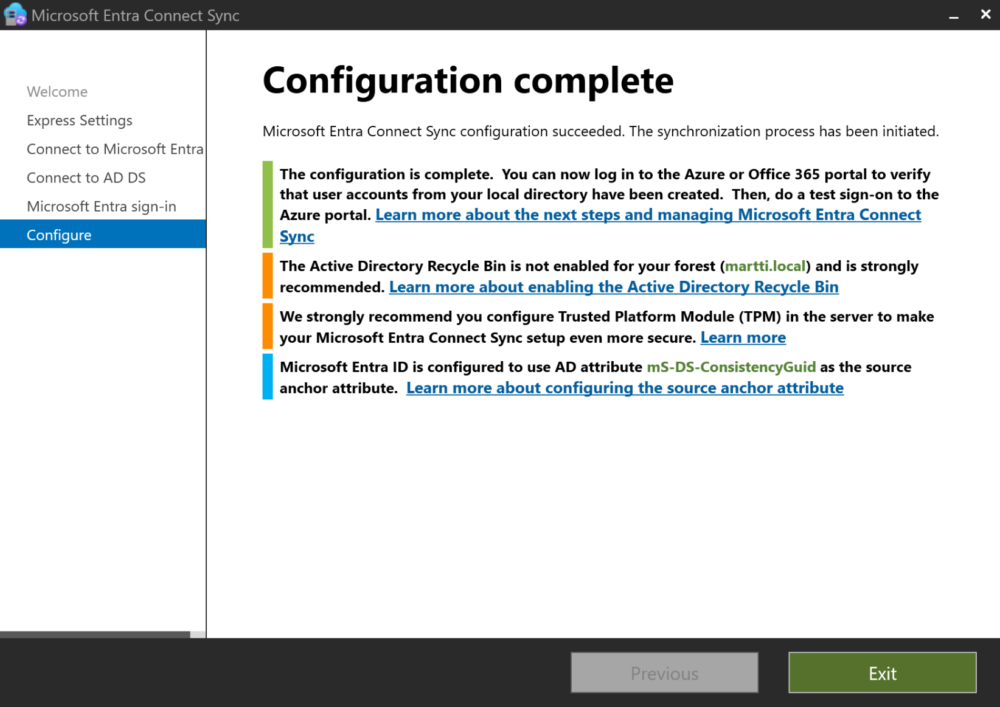 | 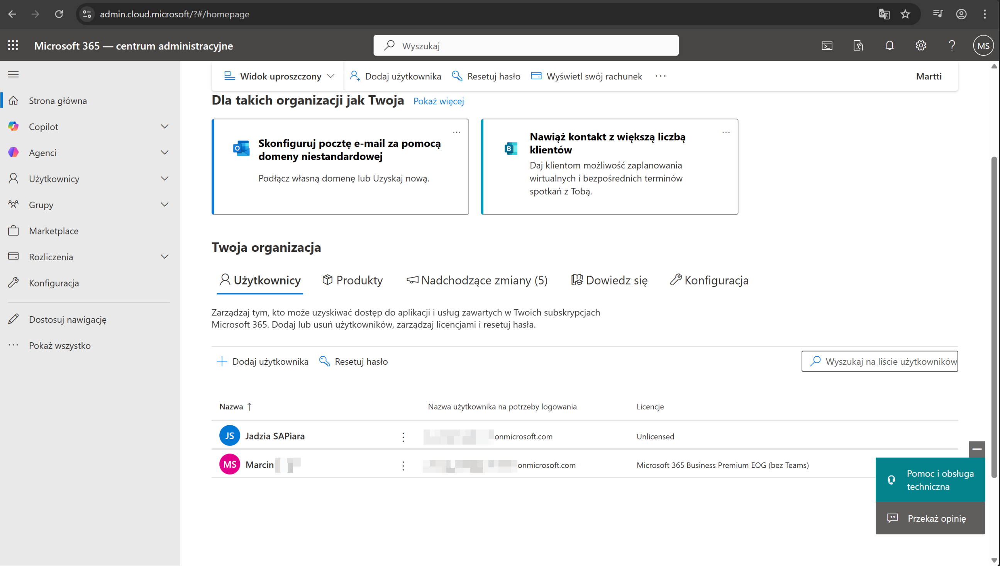 |

### 2.2 Mobile Device Management (Intune)
* **Enrollment:** Onboarded iOS devices via Apple Business Manager integration.
* **Compliance:** Enforced security baselines (Passcode complexity, OS version).

**Fig. 6. Endpoint Security**
*Left: Device successfully enrolled. Right: Intune dashboard showing "Compliant" status after policy enforcement.*
| iOS Enrollment | Intune Compliance |
| :---: | :---: |
| 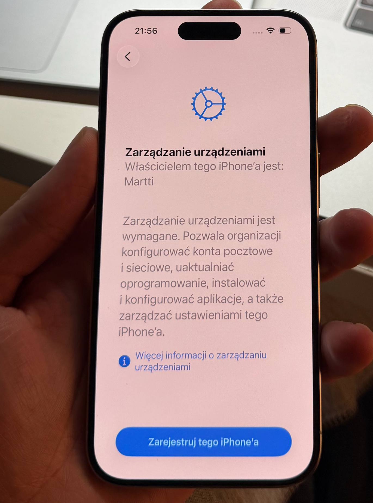 | 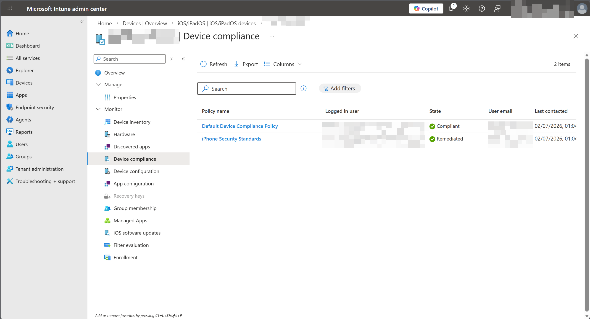 |

---

## Phase 3: Vulnerability Assessment (Red Team Ops)

**Objective:** Simulating real-world attack scenarios to test infrastructure resilience against both legacy vulnerabilities and modern network misconfigurations.

### Preamble: The Illusion of Security (Hardening vs. Reality)
Before commencing the attacks, basic hardening was verified. The user `Jadzia` on the Windows 10 and Windows XP client was restricted via GPO from accessing administrative tools like the Control Panel or CMD.

**Fig. 7. The Limits of Endpoint Restrictions**
*Screenshot proving that GPO restrictions are active on the target machine. While these stop casual snooping, the following steps demonstrate that they are ineffective against network-level attacks.*
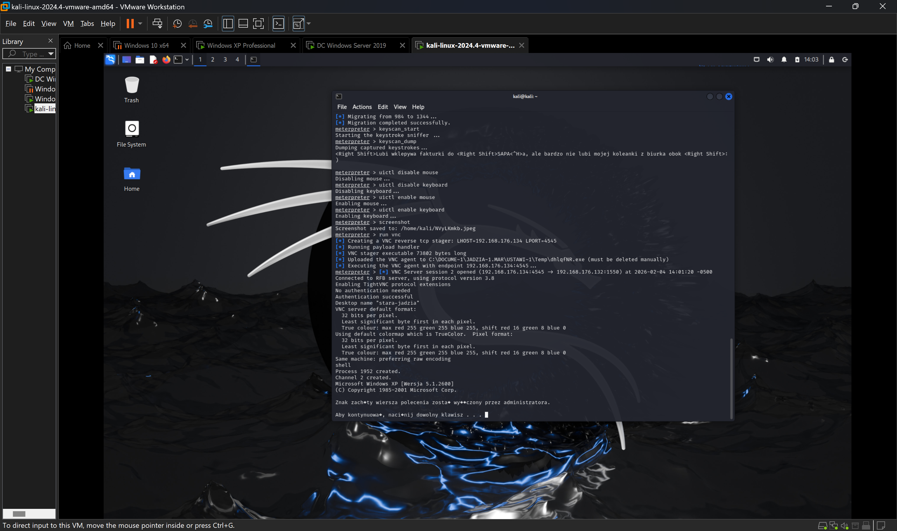

---

### 3.1 Scenario A: Legacy System compromise (Windows XP)
**Target:** An unpatched legacy Windows XP machine connected to the domain network.
**Vector:** Remote Code Execution via **MS08-067 (NetAPI)** using Metasploit.

**Execution Flow:**
1.  **Exploitation:** Successful execution of the exploit resulting in a reverse Meterpreter session (`evidence/Legacy_system_exploit.png`).
2.  **Post-Exploitation:** Utilizing the session to dump local SAM hashes (`evidence/NTLM_hash_capture.png`).

**Fig. 8. Legacy Kill Chain Artifacts**
*Left: Metasploit console showing successful exploit and session opening. Right: Dumping local password hashes via Meterpreter.*
| Exploitation Success | Credential Dumping |
| :---: | :---: |
| 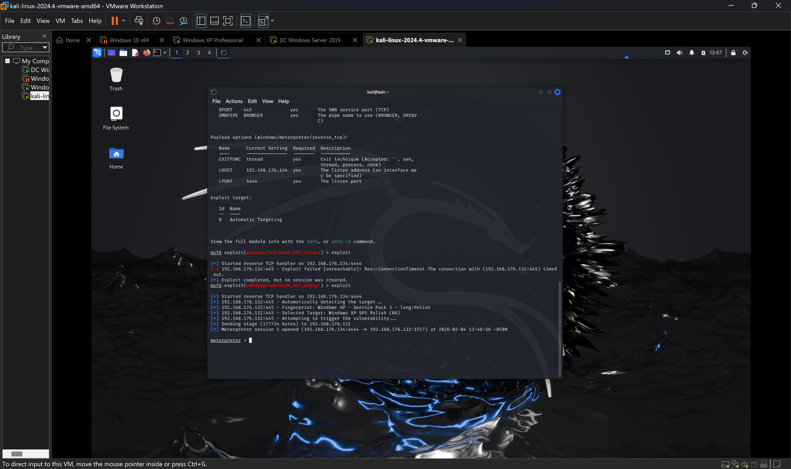 | 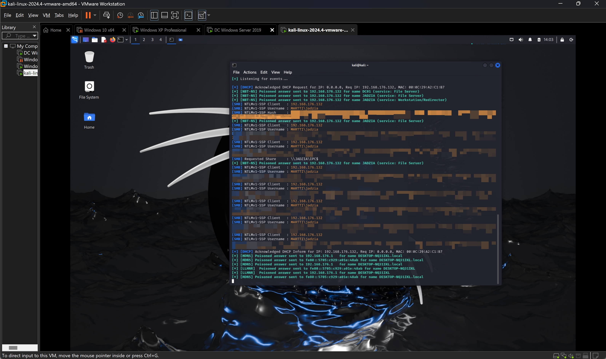 |

**Fig. 9. Proof of Compromise**
*Visual confirmation of system takeover on the target desktop.*
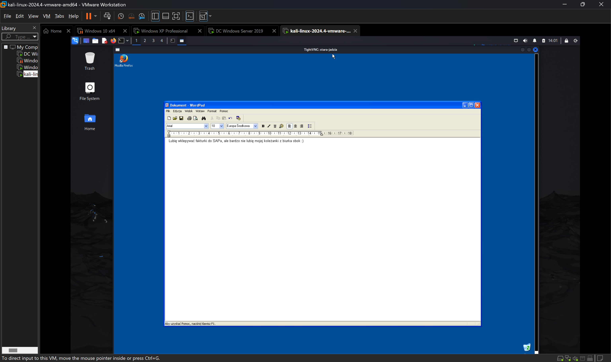

**Fig. 10. Password Cracking (Hashcat)**
*Demonstration of Weak Password Policy: The user's password was cracked in **0 seconds** due to low complexity (`December2008!`).*

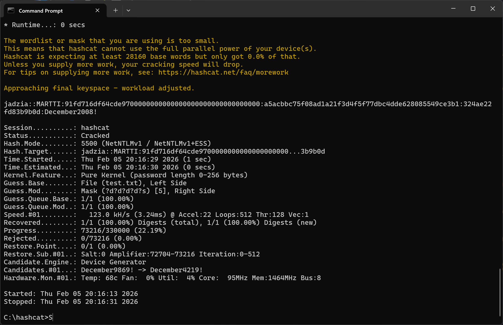

---

### 3.2 Scenario B: Infrastructure Compromise (Domain Controller)
**Target:** Windows Server 2019 (Domain Controller).
**Vector:** **LLMNR/NBT-NS Poisoning**.
**Context:** Despite being the most critical asset in the network, the Domain Controller was configured with default broadcast protocols enabled.

**Execution Flow:**
1.  **Trigger:** The Domain Controller attempted to resolve a non-existent network resource (e.g., a mistyped share path or legacy discovery process).
2.  **Poisoning:** Since DNS failed to resolve the name, the server fell back to LLMNR/NBT-NS broadcast. **Responder** (running on the attacker's machine) intercepted this request, pretending to be the target resource.
3.  **Capture:** The Domain Controller tried to authenticate to the attacker's machine, sending its **NTLMv2 hash**.

**Fig. 11. Network Poisoning in Progress**
*Responder tool actively listening for broadcast requests from the infrastructure.*
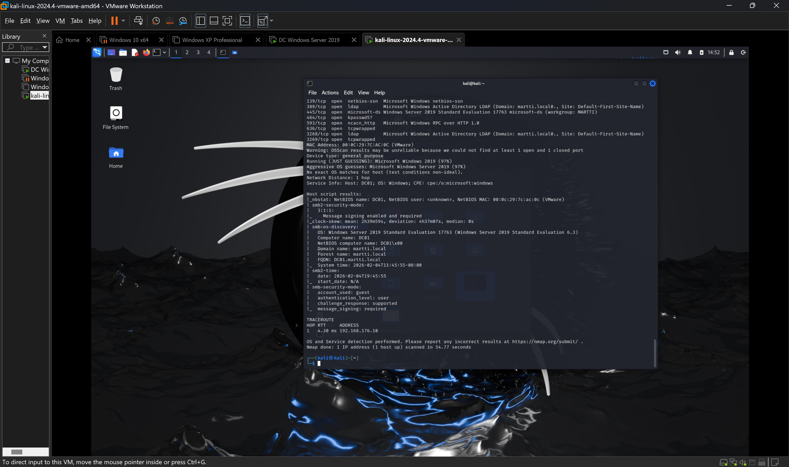

**Fig. 12. Critical Asset Compromise**
*Successful interception of the NTLMv2 hash directly from the Domain Controller. This credential material can be used for offline cracking or NTLM Relay attacks to gain Domain Admin privileges.*

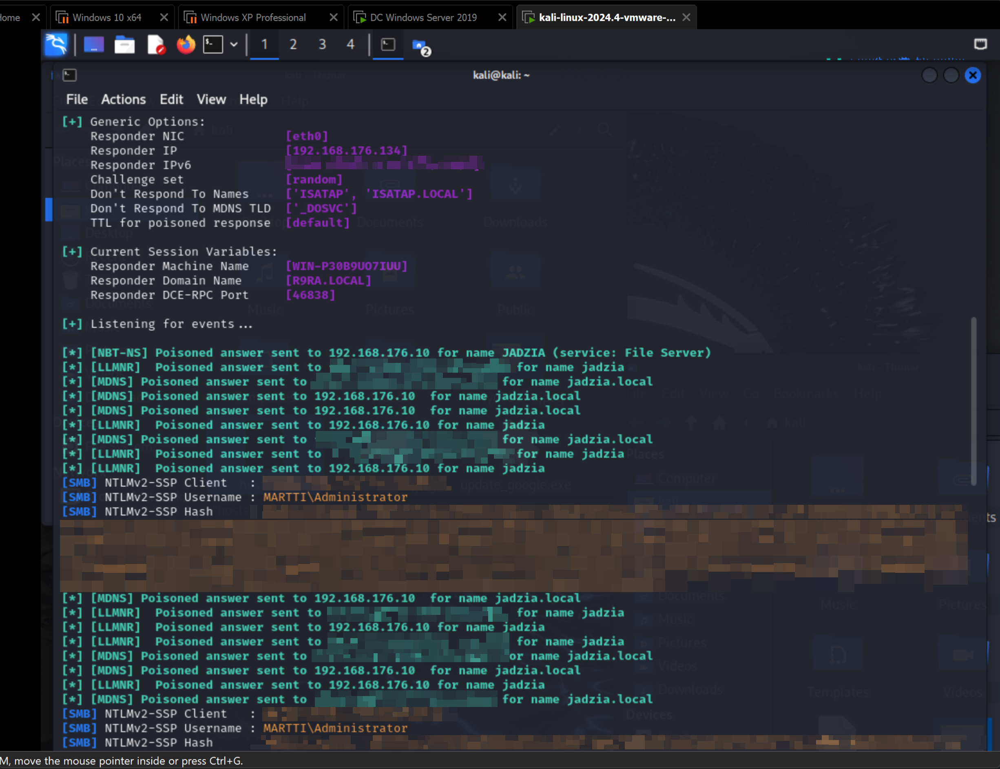

---

## Phase 4: Network Forensics (Blue Team)

**Objective:** Analyzing network traffic captures (PCAP) to identify the signatures of the attacks performed in Phase 3.

**Analysis of the LLMNR/NBT-NS Attack:**
The Wireshark capture below corresponds to the Responder attack (Scenario B).
* **High Volume of NBNS:** We observe excessive NetBIOS Name Service (NBNS) queries for non-existent resources.
* **Poisoned Responses:** The attacker's IP sends immediate, unsolicited answers to these broadcast queries, directing traffic to itself.
* **Port Unreachable (ICMP):** The presence of ICMP "Destination unreachable (Port unreachable)" messages often indicates automated scanning tools hitting closed ports on target machines.

**Fig. 13. Traffic Analysis Signature**
*Wireshark capture highlighting the noisy network footprint generated during the NetBIOS/LLMNR poisoning attack and reconnaissance scanning.*
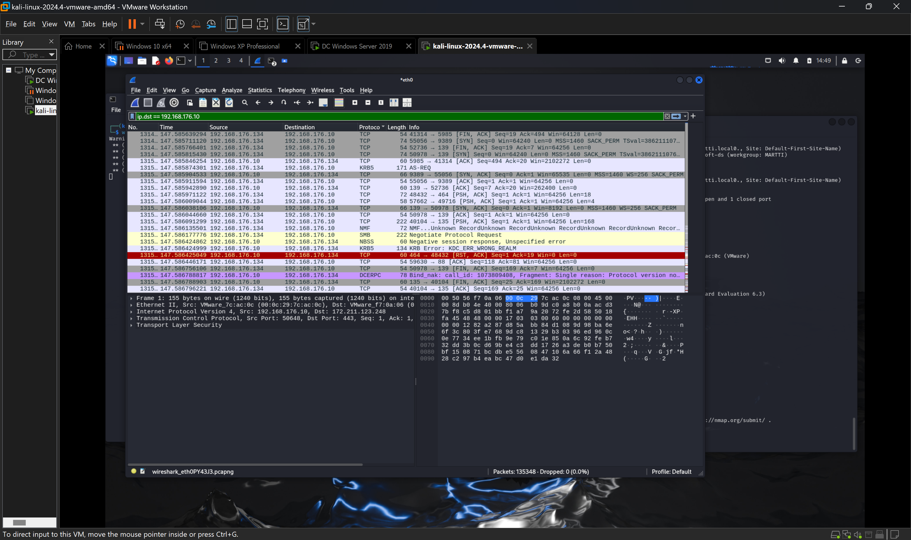

---

### Tech Stack Summary
* **Virtualization:** VMware Workstation Pro, Oracle VirtualBox
* **Core:** Windows Server 2019, Windows 10, Windows XP
* **Cloud:** Microsoft Entra ID, Microsoft Intune
* **Security:** Kali Linux, Metasploit, Responder, Hashcat, Wireshark
* **Scripting:** PowerShell (CIM/WMI)
