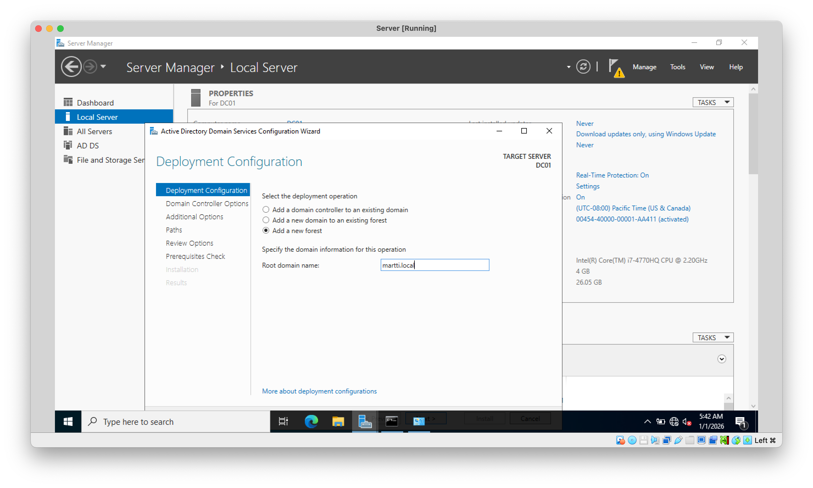
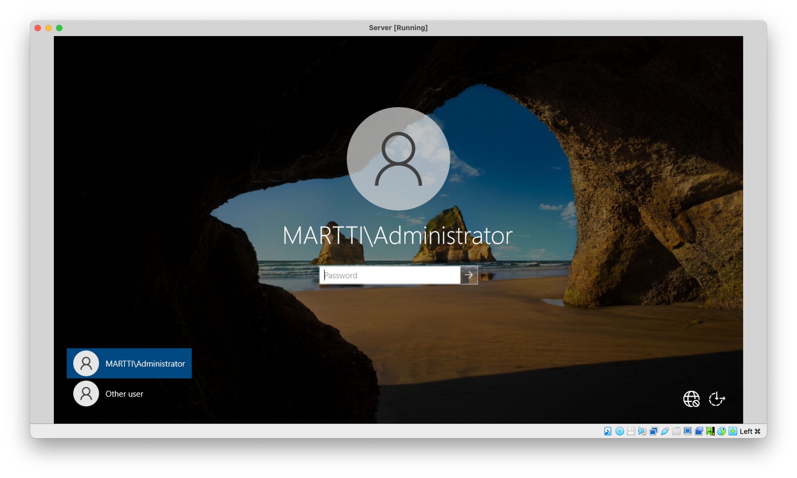
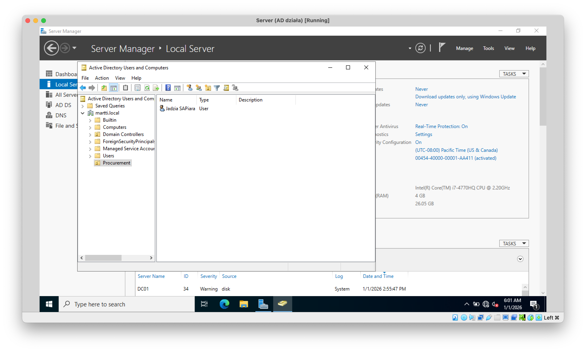
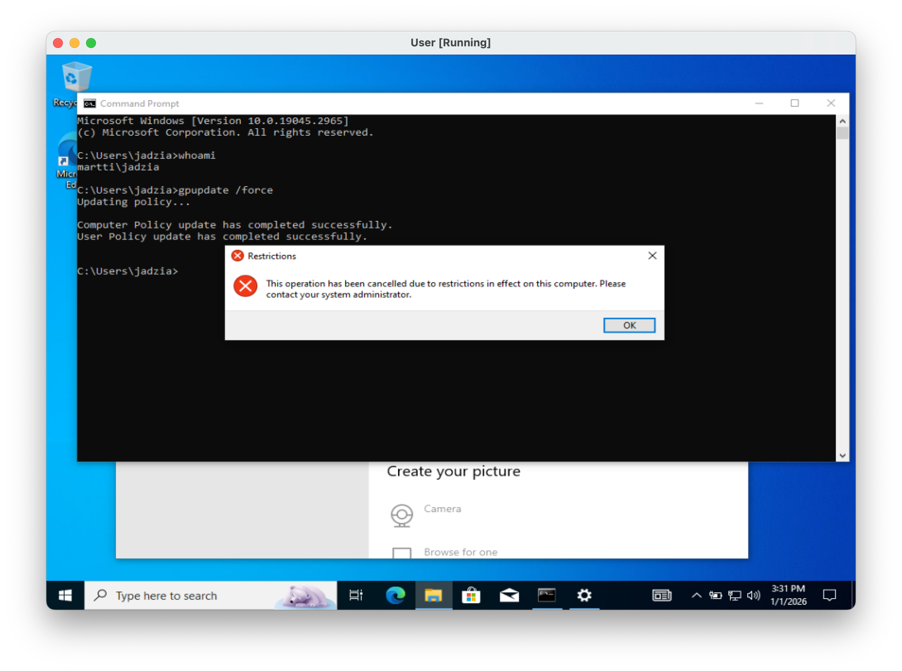
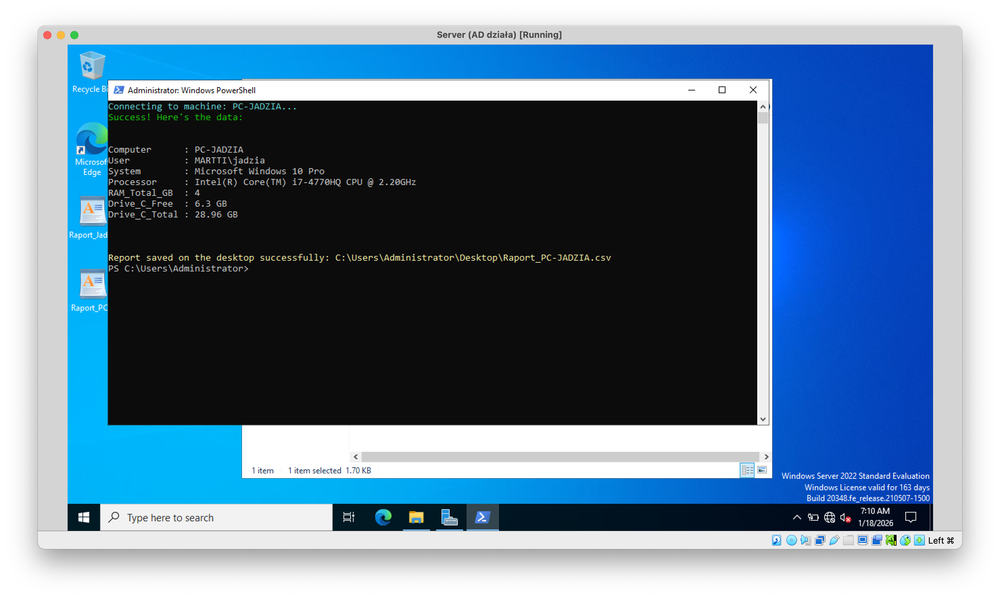
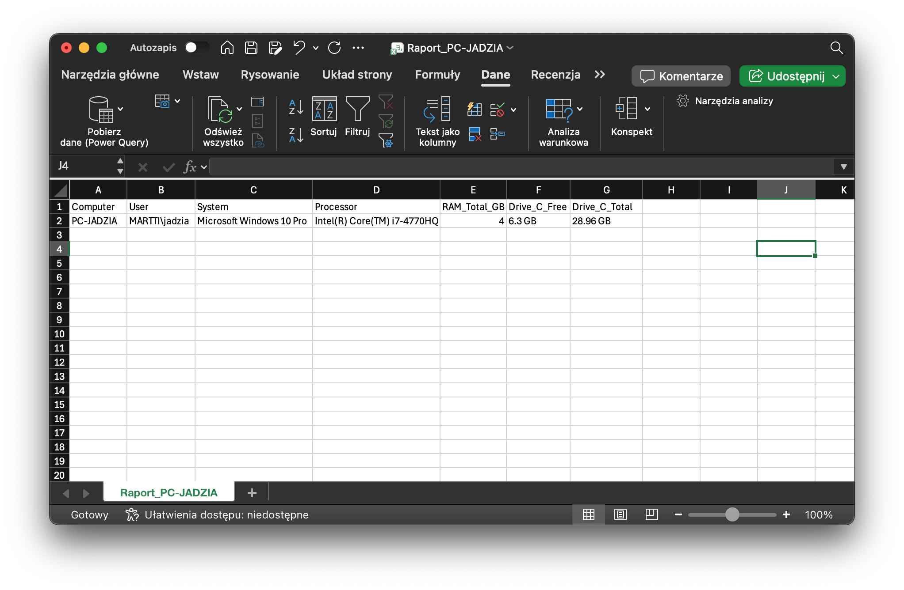

# junior-admin-portfolio
A virtualized enterprise environment simulation (Windows Server 2019 Evaluation + Win10 Pro) featuring Active Directory deployment, GPO hardening, and PowerShell automation scripts for user onboarding and auditing.

Windows AD & Security Lab
Personal home lab project to practice Windows Server administration, PowerShell automation, and security hardening.

 What I did:

[x] Infrastructure: Set up Windows Server 2019 (DC) & Windows 10 Client.

[x] Identity: Created User "Jadzia" and managed OUs.

[x] Automation: Wrote a PowerShell script to audit disk space & specs (export to CSV).

[x] Security (GPO): Blocked Control Panel access for regular users.

 Repository Content:

/scripts - My PowerShell automation scripts.

/evidence - Screenshots and sample reports proving it works.

Proof of Concept:


1. ***Active Directory Setup Domain Controller and connected Client.***

**Fig. 1. Active Directory Forest Provisioning**
*Initializing the new AD environment. Configured the server as the first Domain Controller in a new Forest with the root domain `martti.local`.*


**Fig. 2. Login Screen**  
*Server promoted to DC status, verified by the domain login context (`MARTTI\Administrator`).*


**Fig. 3. Identity Management (IAM)**
*Active Directory console showing the custom "Procurement" OU and provisioned user "Jadzia".*



2. ***GPO Hardening in Action User "Jadzia" cannot access Control Panel.***

**Fig 4. GPO Enforcement**
*User "Jadzia" is blocked from accessing the Control Panel.*


3. ***PowerShell Automation & Reporting Script generates a CSV report of the machine specs.***
   
Here is the PowerShell script used to audit the system. It uses CIM instances to retrieve hardware data without requiring third-party tools.

**Source File:** [View full script](scripts/info_gathering_automation.ps1)
<details>
<summary><b> CLICK HERE to expand the PowerShell Source Code</b></summary>
<br>
 
```powershell
 
$ComputerName = "PC-JADZIA" 

Clear-Host
Write-Host "Connecting to machine: $ComputerName..." -ForegroundColor Cyan

try {
    # 1. Operating System
    $OSInfo = Get-CimInstance -ClassName Win32_OperatingSystem -ComputerName $ComputerName -ErrorAction Stop

    # 2. Processor
    $CPUInfo = Get-CimInstance -ClassName Win32_Processor -ComputerName $ComputerName

    # 3. RAM and Computer Model
    $SysInfo = Get-CimInstance -ClassName Win32_ComputerSystem -ComputerName $ComputerName
    $RamGB = [math]::Round($SysInfo.TotalPhysicalMemory / 1GB, 2)

    # 4. Drive C info
    #
    $DiskInfo = Get-CimInstance -ClassName Win32_LogicalDisk -ComputerName $ComputerName | Where-Object DeviceID -eq "C:"
    
    # converting bytes into gigabytes for clarity
    $FreeSpaceGB = [math]::Round($DiskInfo.FreeSpace / 1GB, 2)
    $TotalSpaceGB = [math]::Round($DiskInfo.Size / 1GB, 2)

    # 5. Building the report
    $Raport = [PSCustomObject]@{
        Computer      = $SysInfo.Name
        User    = $SysInfo.UserName
        System        = $OSInfo.Caption
        Processor      = $CPUInfo.Name
        RAM_Total_GB  = $RamGB
        Drive_C_Free  = "$FreeSpaceGB GB"
        Drive_C_Total = "$TotalSpaceGB GB"
    }

    # Display the results
    Write-Host "Success! Here's the data:" -ForegroundColor Green
    $Raport | Format-List

    # Save in CSV format on the desktop
    $Path = "$env:USERPROFILE\Desktop\Raport_$ComputerName.csv"
    $Raport | Export-Csv -Path $Path -NoTypeInformation -Encoding UTF8
    Write-Host "Report saved on the desktop successfully: $Path" -ForegroundColor Yellow

} catch {
    Write-Error "Couldn't connect to machine $ComputerName. Please check if the machine is working and if you have the admin rights!"
}
```
</details>

**Fig. 5. Using PowerShell script**
*PowerShell script gathering basic machine data such as Processor info and free available disk space*


**Fig. 6. Automation Output (Result)**
*The script successfully gathers system metrics and exports them to a structured CSV file for inventory purposes.*

